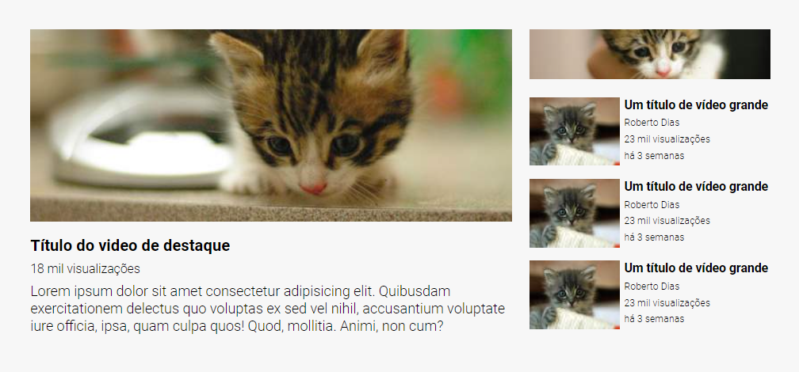
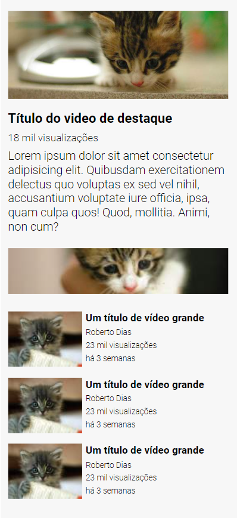

# Layout Youtube
Esse é mais um desafio do curso DevQuest, onde eu vou resolvê-lo com o Flex Grid do CSS.

## Índice

- Design
- Tecnologias utilizadas

## Visão geral

### Design desktop 🖥️

### Design mobile 📱

## Tecnologias utilizadas

- HTML
- CSS
